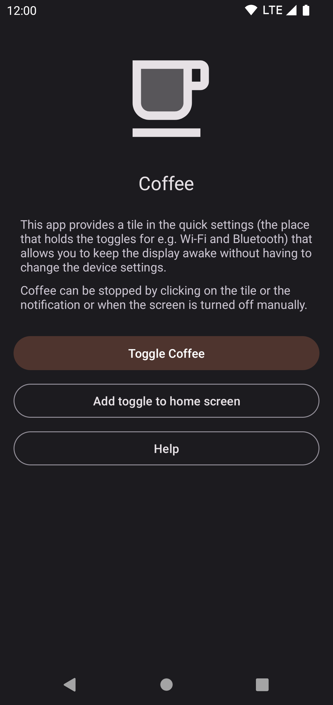

# Coffee

This Android app allows you to keep the display awake without having to change the device settings. It can be toggled at various places:
* A tile in the quick settings, the place that holds the toggles for e.g. Wi-Fi and Bluetooth. Requires Android 7 or higher.
* A button in the app itself
* A shortcut on your home screen. It can be created in the app, if your launcher supports it.

Coffee can be set as assist app (Device settings => `Apps` => `Default apps` => `Assist app`) and changes it's state when assist is called.

## Maintenance notice

From my point of view this app is feature complete. I probably won't add new major features on my own, but I will:
* Keep dependencies up-to-date
* Merge new translations
* Fix bugs
* Review and merge PRs, even for new features

## Translations

App strings and the app store description can be translated via Crowdin: https://crowdin.com/project/coffee-app

Translations have to be approved before being merged into the app. To become a translator with approval rights or to request a new language, please [poke me on Crowdin](https://crowdin.com/profile/mueller-ma) or open an issue here on GitHub. 

## Troubleshooting

Coffee may not work because of an overly aggressive battery saver that is implemented by some OEMs (including Poco, Samsung and Xiaomi).
In that case please enable "Alternate mode" in the settings.

## Credits

* Feature graphic by https://unsplash.com/@mukulwadhwa
